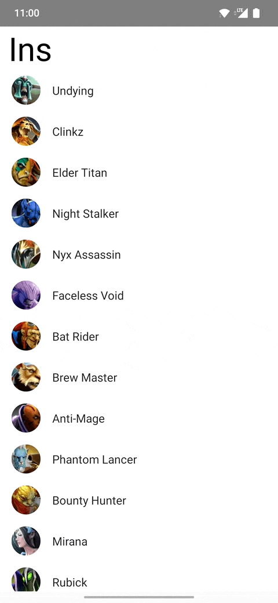
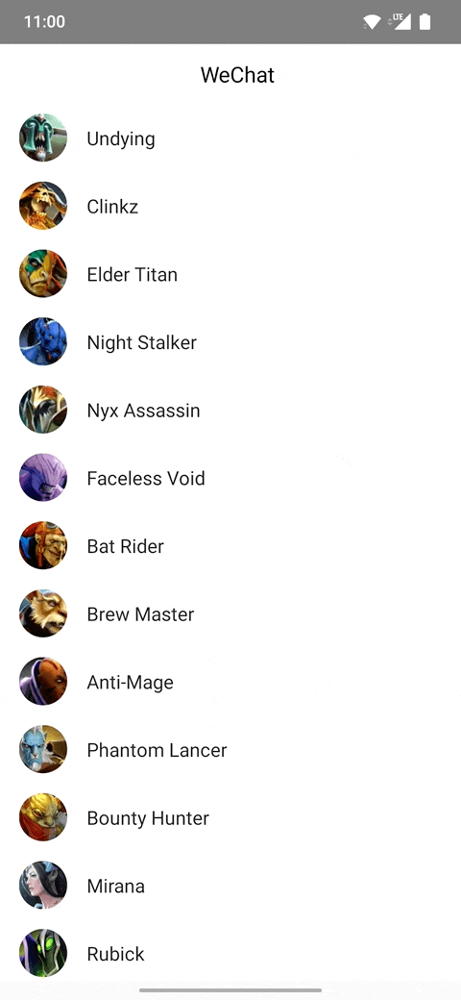
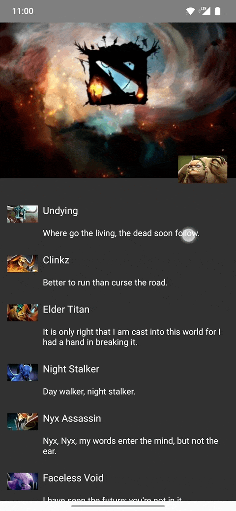
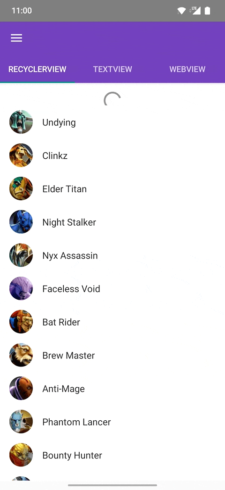

# android-nest-scroll-ptr

[中文介绍](https://github.com/s1rius/android-nest-scroll-ptr/blob/master/README_CN.md)

This library implements pull-to-refresh logic and work with nested-scroll. It is easy to use and extend.

It is driven by a [StateMachine](https://github.com/Tinder/StateMachine)

### Requirements

- minsdk 14
- kotlin

### Features

- work with nested-scroll
- easy to customize the child widget


### Demo

- Ins



- Wechat



- Wechat Moment



- NestedScroll Sample




### Use NSPtr in your application

- add the dependency

```
repositories {
    ...
    mavenCentral()
    ...
}

dependencies {
    ...
    // android view system implementation
    implementation "wtf.s1.ptr:nsptr-view:x.x.x"
    // jetpack compose implementation
    implementation "wtf.s1.ptr:nsptr-compose:x.x.x"
    ...
}
```

- add a layout to view hierarchy

```
addView(
    NSPtrEZLayout(context).apply {
        addView(
            RecyclerView(context).apply {
                // add data and adapter
            },
            NSPtrLayout.LayoutParams(
                LayoutParams.MATCH_PARENT, 
                LayoutParams.MATCH_PARENT
            )
        )

        addPtrListener(object : NSPtrListener {
            override fun onRefreshing(ptrLayout: NSPtrLayout) {
                super.onRefreshing(ptrLayout)
                // do refresh logic
            }
        })
		// auto refresh
		isRefreshing = true
    },
    LayoutParams(LayoutParams.MATCH_PARENT, LayoutParams.MATCH_PARENT)
)
```

- or use in XML layouts

```
<wtf.s1.ptr.nsptr.view.NSPtrEZLayout
    android:layout_width="match_parent"
    android:layout_height="match_parent">

    <androidx.recyclerview.widget.RecyclerView
        android:layout_width="match_parent"
        android:layout_height="match_parent"/>

</wtf.s1.ptr.nsptr.view.NSPtrEZLayout>
```