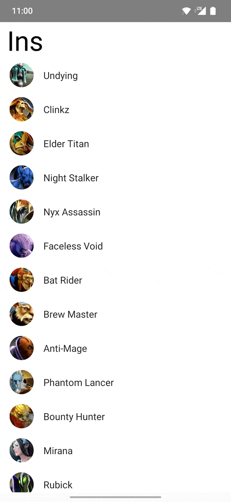
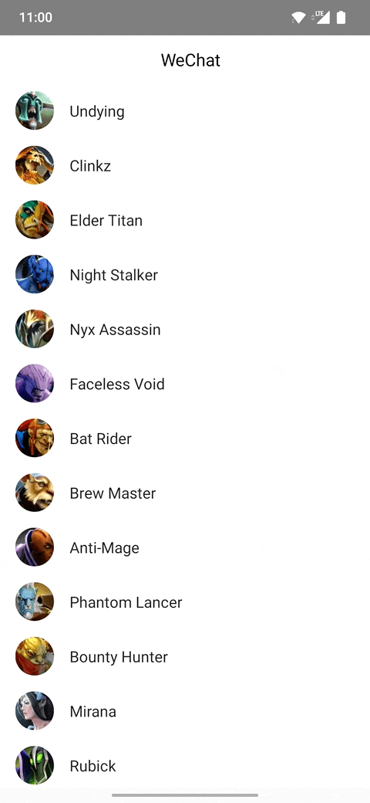
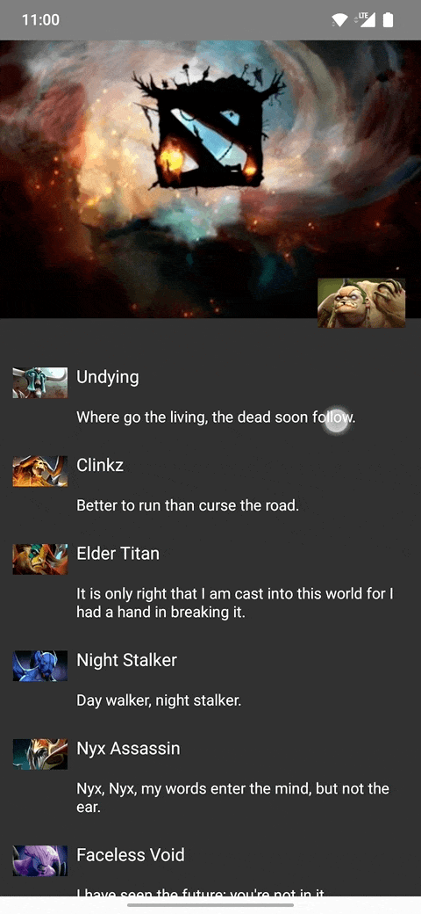
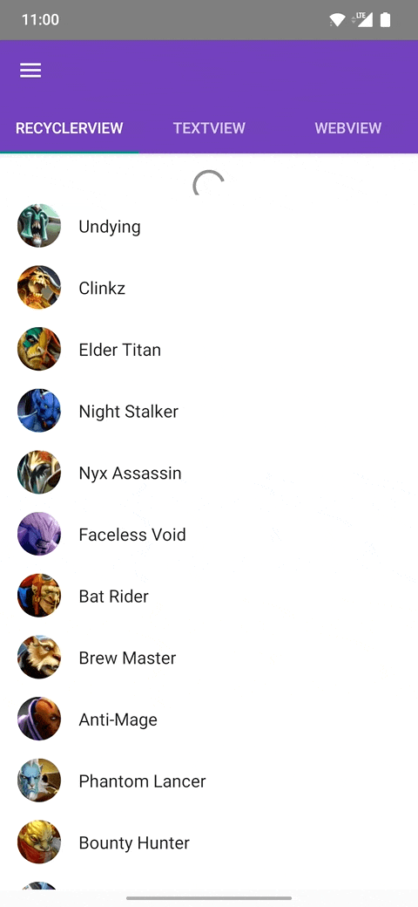

# android-nest-scroll-ptr

本库实现了下拉刷新的逻辑，且实现了嵌套滑动接口。在嵌套滑动机制下正常工作。易于扩展和自定义。

### 支持环境

- minsdk 14
- kotlin

### 特性

- 支持嵌套滑动
- 易于扩展


### Demo

- instagram 刷新样式



- 微信首页小程序下拉



- 微信朋友圈下拉



- Android 官方嵌套滑动 demo 适配




### 开始使用

- 添加依赖

```
repositories {
    ...
    mavenCentral()
    ...
}
dependencies {
    ...
    implementation "wtf.s1.ptr:nsptr:x.x.x"
    ...
}
```

- 用代码实现

```
addView(
    NSPtrEZLayout(context).apply {
        addView(
            RecyclerView(context).apply {
                // 添加数据和adapter
            },
            NSPtrLayout.LayoutParams(
                LayoutParams.MATCH_PARENT, 
                LayoutParams.MATCH_PARENT
            )
        )

        addPtrListener(object : NSPtrListener {
            override fun onRefreshing(ptrLayout: NSPtrLayout) {
                super.onRefreshing(ptrLayout)
                // 下拉刷新开始，请求网路
            }
        })
		// 自动刷新
		isRefreshing = true
    },
    LayoutParams(LayoutParams.MATCH_PARENT, LayoutParams.MATCH_PARENT)
)
```

- 用XML实现

```
<wtf.s1.android.ptr.NSPtrEZLayout
    android:layout_width="match_parent"
    android:layout_height="match_parent">

    <androidx.recyclerview.widget.RecyclerView
        android:layout_width="match_parent"
        android:layout_height="match_parent"/>

</wtf.s1.android.ptr.NSPtrEZLayout>
```